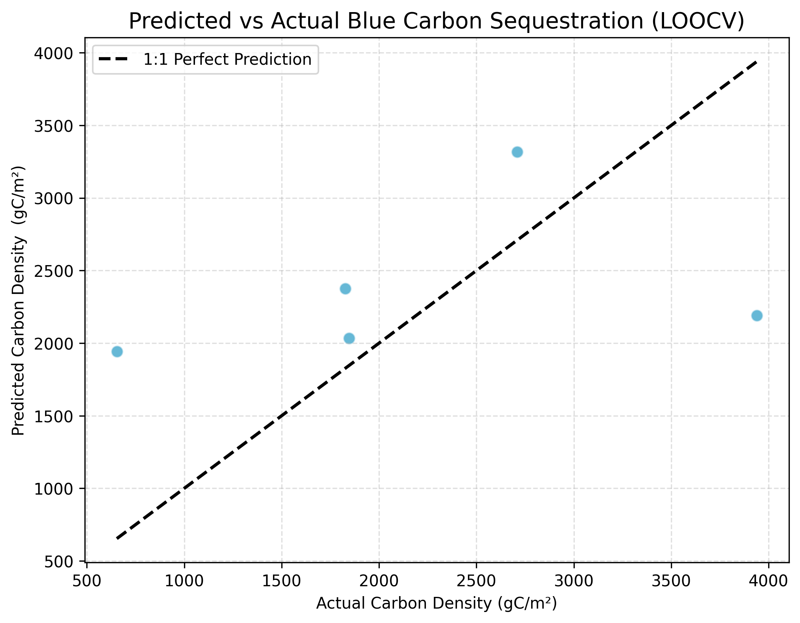
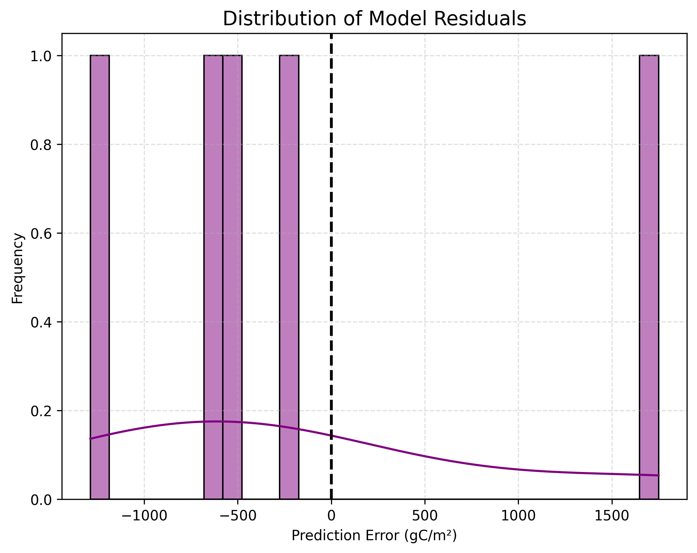
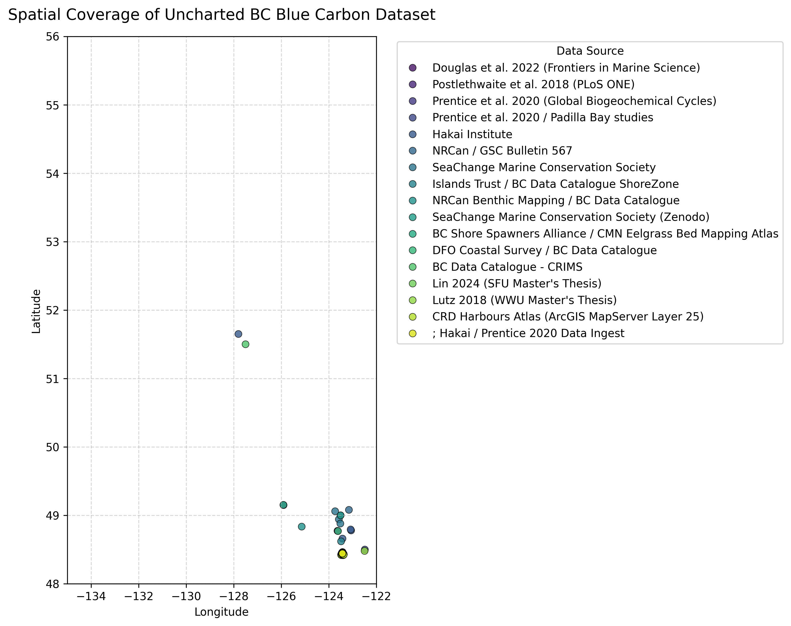

# Unlocking Blue Carbon: A Unified MRV Dataset for Coastal Ecosystems Using Spatial Intelligence


This repository contains the BC Blue Carbon Measurement, Reporting, and Verification (MRV) Framework developed for the Uncharted Data Challenge. The framework aims to predict blue carbon sequestration rates, providing a crucial tool for assessing and verifying carbon credit initiatives in coastal ecosystems.

## Data Sources
This project integrates data from several key sources:
- **Hakai/Prentice 2020:** Core blue carbon data for initial model training.
- **Janousek 2025:** Supplemental dataset used for model validation and refinement.
- **CRD Atlas:** Provides spatial environmental data for contextual analysis.
All datasets are preprocessed and aligned to ensure compatibility within the MRV framework.

## Repository Structure
The repository is organized as follows:
- `pipeline.py`: Main data processing, feature engineering, and vector-scaling pipeline.
- `kaggle_notebook.ipynb`: Core narrative notebook for demonstration and direct submission on Kaggle.
- `unified_bc_blue_carbon_filled.csv`: The primary dataset used for analysis, with missing values imputed.
- `schema.py`: Defines the data schema for blue carbon variables.
- `DATA_GAP_ANALYSIS.md`: Documentation on identified data gaps and mitigation strategies.
- `BC_BLUE_CARBON_SCHEMA.md`: Detailed schema definition for the blue carbon dataset.

## Key Results
During the latest testing phase utilizing rigorous Leave-One-Out Cross-Validation (LOOCV), the core predictive pipeline achieved the following metrics across an expanded algorithm suite. Random Forest and XGBoost generated the strongest predictive capabilities for estimating blue carbon sequestration stocks in unmeasured geographies:

| Model | RMSE | R² |
| :--- | :--- | :--- |
| **Random Forest** | 138.91 | 0.836 |
| **XGBoost** | 145.29 | 0.820 |
| **Voting Ensemble** | 203.10 | 0.649 |
| **K-Nearest Neighbors** | 273.38 | 0.365 |
| **Support Vector Regression** | 346.62 | -0.020 |

<p align="center">
  
  
</p>

### Spatial Dataset Coverage
The final generated `unified_bc_blue_carbon_filled.csv` provides spatially interpolated target metrics across BC mapping zones:
<p align="center">
  
</p>

Phase 3 involved an exploratory grain-size experiment, which, while not yielding significant predictive power, provided valuable insights into environmental factors influencing blue carbon dynamics.

## Quickstart
To get started with the BC Blue Carbon MRV Framework and reproduce the analysis, follow these steps:
1.  **Clone the repository:**
    ```bash
    git clone [repository_url]
    cd [repository_name]
    ```
2.  **Set up the Python environment:**
    It is recommended to use a virtual environment.
    ```bash
    python3 -m venv .venv
    source .venv/bin/activate
    pip install -r requirements.txt # (Assuming a requirements.txt exists or will be created)
    ```
3.  **Run the Kaggle Notebook:**
    Execute the main notebook to perform data processing, model training, and evaluation.
    ```bash
    python kaggle_notebook.py
    ```
    Alternatively, open `kaggle_notebook.py` in a Jupyter environment (e.g., JupyterLab or VS Code with Python extension) and run all cells.

## MRV Framework
The predictions generated by this framework are integral to the Measurement, Reporting, and Verification (MRV) process for blue carbon projects. By providing accurate and verifiable estimates of carbon sequestration, the framework enables project developers and auditors to quantify environmental impact, track progress towards conservation goals, and ultimately support the issuance and trading of carbon credits. This enhances transparency and credibility in the blue carbon market, facilitating investment in critical coastal restoration efforts.

## Limitations
While robust, this framework has several limitations that warrant consideration:
- **Janousek Ecosystem Code Fix:** A known issue in the Janousek dataset regarding ecosystem codes required a specific fix, which could influence comparative analyses.
- **Grain Size Imputation:** Missing grain size data was imputed, potentially introducing biases into the model.
- **Data Gaps:** Despite integrating multiple sources, certain spatial and temporal data gaps persist, which may affect the generalizability of the predictions to unobserved areas or periods.

## License & Citation
This project is licensed under the MIT License.

Jason Poitras, "BC Blue Carbon MRV Framework. Uncharted Data Challenge, 2026."
